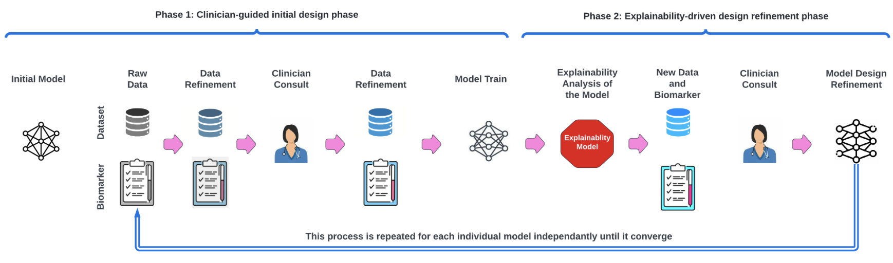
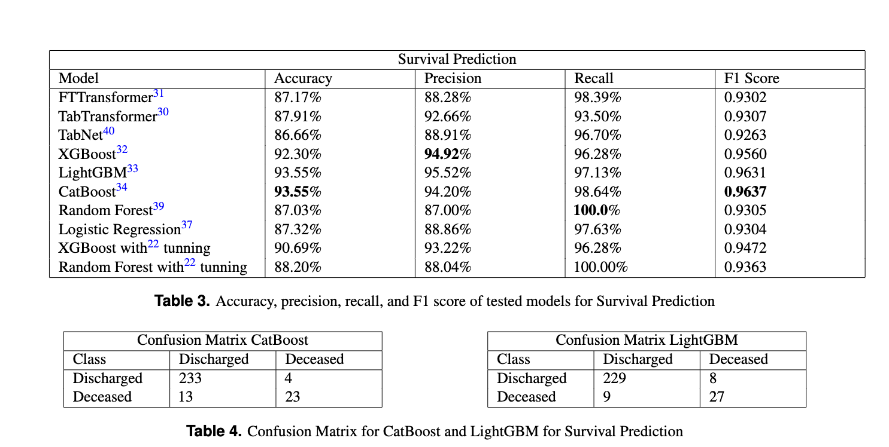
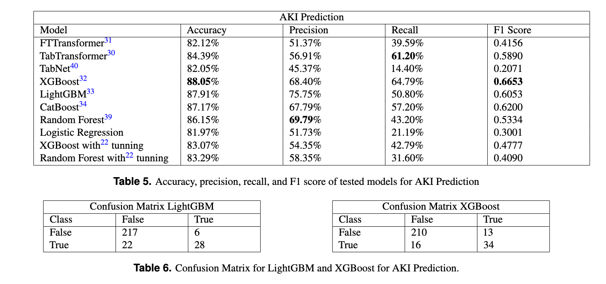
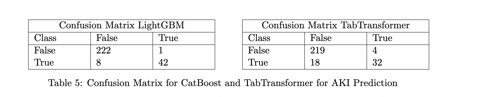

# COVID-Net Biochem

<p align="center">
	
	<br>
	<em></em>
</p>


This code is for the paper **COVID-Net Biochem: An Explainability-driven Framework to Building Machine Learning Models for Predicting Survival and Kidney Injury of COVID-19 Patients from Clinical and Biochemistry Data** 

**Link to the [paper](https://arxiv.org/pdf/2204.11210.pdf)**


<p align="center">
	
	<br>
	<em>Figure 1: Overview of the proposed explainability-driven framework for building machine
learning models for clinical decision support.</em>
</p>

**COVID-Net Biochem is core part of COVID-Net, a global open source, open access initiative dedicated to accelerating advancement in machine learning to aid front-line healthcare workers and clinical institutions around the world fighting the continuing pandemic. Link to COVID-Net portal: [here](https://alexswong.github.io/COVID-Net/)**

**Recording to webinar on [How we built COVID-Net in 7 days with Gensynth](https://darwinai.news/fny)**

**Note: The COVID-Net models provided here are intended to be used as reference models that can be built upon and enhanced as new data becomes available. They are currently at a research stage and not yet intended as production-ready models (not meant for direct clinical diagnosis), and we are working continuously to improve them as new data becomes available. Please do not use COVID-Net for self-diagnosis and seek help from your local health authorities.**

## Abstract

Ever since the declaration of COVID-19 as a pandemic by the World Health Organization
(Pak et al., 2020) in 2020, the world has continued to struggle in controlling and contain-
ing the spread of the COVID-19 pandemic caused by the SARS-CoV-2 virus. This has
been especially challenging with the rise of the Omicron variant and its subvariants and
recombinants, which has led to a significant increase in patients seeking treatment and
has put a tremendous burden on hospitals and healthcare systems. A major challenge
faced during the pandemic has been the prediction of survival and the risk for additional
injuries in individual patients, which requires significant clinical expertise and additional
resources to avoid further complications. In this study we propose COVID-Net Biochem,
an explainability-driven framework for building machine learning models to predict patient
survival and the chance of developing kidney injury during hospitalization from clinical and
biochemistry data in a transparent and systematic manner. In the first “clinician-guided
initial design” phase, we prepared a benchmark dataset of carefully selected clinical and bio-
chemistry data based on clinician assessment, which were curated from a patient cohort of
1366 patients at Stony Brook University. A collection of different machine learning models
with a diversity of gradient based boosting tree architectures and deep transformer architec-
tures was designed and trained specifically for survival and kidney injury prediction based
on the carefully selected clinical and biochemical markers. In the second “explainability-
driven design refinement” phase, we harnessed explainability methods to not only gain a
deeper understanding into the decision-making process of the individual models, but also
identify the overall impact of the individual clinical and biochemical markers to identify potential biases. These explainability outcomes are further analyzed by a clinician with over
eight years experience to gain a deeper understanding of clinical validity of decisions made.
These explainability-driven insights gained alongside the associated clinical feedback are
then leveraged to guide and revise the training policies and architectural design in an iter-
ative manner to improve not just prediction performance but also improve clinical validity
and trustworthiness of the final machine learning models. Using the proposed explainable-
driven framework, we achieved 98.1% accuracy in survival prediction and 96.7% accuracy
in predicting kidney injury complication, with the models made available in an open source
manner. While not a production-ready solution, the ultimate goal of this study is to act
as a catalyst for clinical scientists, machine learning researchers, as well as citizen scien-
tists to develop innovative and trust-worthy clinical decision support solutions for helping
clinicians around the world manage the continuing pandemic.
© 2022 .

####  Dataset Description

In this section we provide a short overview of the dataset preparation process in constructing a benchmark dataset for COVID-19 patient survival and AKI prediction in the clinician-guided initial design phase of the proposed framework. The proposed dataset is built by carefully selecting clinical and biochemical markers based on clinical assessment  from a patient cohort curated by Stony Brook University [here](https://wiki.cancerimagingarchive.net/pages/viewpage.action?pageId=89096912). More specifically, the clinical and biochemical markers were collected from a patient cohort of 1336 COVID-19 positive patients, and consists of both categorical and numerical markers.  The clinical and biochemical markers include patient diagnosis information, laboratory test results, intubation status, oral temperature, symptoms at admission, as well as a set of derived biochemical markers from blood work.


The raw dataset exists on ```Covid_biochem/pytorch_tabular_main/data/clinical_data.csv```


#### Results


<p align="center">
	
	<br>
	<em></em>
</p>


<p align="center">
	
	<br>
	<em></em>
</p>


<p align="center">
	
	<br>
	<em></em>
</p>

#### Explainability Results

<p align="center">
	
	<br>
	<em></em>
</p>

#### Contact

If there are any technical questions after the README, FAQ, and past/current issues have been read, please post an issue or contact:

* hossain.aboutalebi@gmail.com
* mspavlova@uwaterloo.ca 

#### Citation

```
@article{
title={COVID-Net Biochem: An Explainability-driven Framework to Building Machine Learning Models for Predicting Survival and Kidney Injury of COVID-19 Patients from Clinical and Biochemistry Data},
author={Aboutalebi, Hossein and Pavlova, Maya and Shafiee , Mohammad Javad and Florea  , Adrian and Hryniowski , Andrew and Wong, Alexander},
journal={arXiv preprint arXiv:2204.11210},
year={2022}
}

```


### Instruction to replicate results

This code is for doing survival prediction and Acute Kidney Injury prediction of COVID-19 patients. For survival prediction, use ```main```  branch. For Acute Kidney Injury predictio, use ```kidney```  branch. The code automatically creates the benchmark dataset online.

The main file for doing prediction is ```main.py```.
```main.py``` has argparser where you can set the model for prediction, change learning rate, select test size and other configs.

Currently we support the following models:

1- [TabTransformer](https://arxiv.org/abs/2012.06678) by selecting: ```--model tabtransformer```

2- [FTTransformer](https://arxiv.org/pdf/2106.11959.pdf) by selecting: ```--model FTTransformer```

3- [TabNet](https://arxiv.org/abs/1908.07442) by selecting: ```--model tabnet```

4- [CatBoost](https://arxiv.org/abs/1706.09516) by selecting: ```--model catboost```

5- [LightGBM](https://proceedings.neurips.cc/paper/2017/file/6449f44a102fde848669bdd9eb6b76fa-Paper.pdf) by selecting: ```--model lightgbm```

6- [XGBoost](https://arxiv.org/abs/1603.02754) by selecting: ```--model XGBoost```

***The default value set for models in argparser should regenerate the results***

### Custom Run
For running the TabTransformer model with learning rate 0.00015 and batch size 256 and validation size 0.05 for 200 epochs, use the code bellow:

 ```python3 main.py --model tabtransformer --lr 0.00015 --batch_size 256 --epochs 200 --val_size 0.05```

The ```--useless_cols``` removes columns from csv file that should not be passed as an input for training model.

You can also change the seed of the run by passing ```--seed```.


